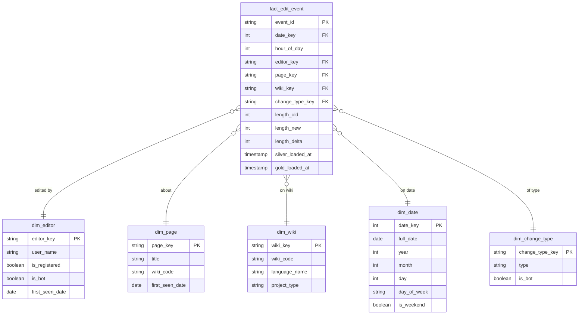

# SPEC — Phase 4: Gold (Dimensional Modeling via Spark Declarative Pipelines + Streamlit Dashboard)

**Depends on:** `SPEC-agnostic-architecture.md` (principles P1–P8, conventions 9.1–9.5.1), `SPEC-phase3-silver-cdf.md` (CDF enabled on silver, the Kimball-ready modeling decision, `silver_recentchange.contract.yaml` contract), `SPEC-phase2-bronze.md` (`bronze_dim_wiki_reference`).
**Does not redecide anything already fixed in those documents — only references them.**

---

## 1. Objective

Model silver as an explicit Kimball star schema, materialize it incrementally as a Spark Declarative Pipeline — using SDP's Auto CDC flow for the dimensions (native SCD Type 1/2 support) and a plain append flow for the fact table — and deliver a Streamlit dashboard for visualization. Feature store and ML projects remain explicitly out of scope.

## 2. Scope

**In scope:**
- Dimensional modeling (star schema) with an exportable ER diagram.
- `dim_editor`, `dim_page`, `dim_wiki` materialized via SDP's Auto CDC (`create_auto_cdc_flow`/`CREATE FLOW ... AUTO CDC`).
- `dim_wiki` enriched by joining the stream-derived wiki code against `bronze_dim_wiki_reference` (Phase 2).
- `fact_edit_event` materialized via a plain append flow (no CDC/SCD — see Section 4 for why).
- A Streamlit dashboard with the panels already mapped to stakeholder questions.

**Out of scope (left for a future project):**
- Feature store, any ML model, or a new dashboard/layer to serve them.

## 3. Modeling: unchanged star schema, same ER diagram

Same grain, same tables and relationships as the previous draft — see the ER diagram below, only the `dim_wiki` attributes gained two enriched fields (`language_name`, `project_type`) sourced from `bronze_dim_wiki_reference`.



Save as `docs/gold-model-diagram.mmd` (unchanged requirement).

### 3.1 Modeling decisions (unchanged except where noted)

- **`hour_of_day` degenerate, `dim_change_type` a junk dimension** — unchanged reasoning from the prior draft.
- **`dim_wiki` is now a conformed dimension from two sources**: `wiki_code` and `first_seen_date` derive from the fact stream (via silver); `language_name`/`project_type` come from `bronze_dim_wiki_reference`. This is exactly the realistic multi-source scenario the Section 3 addition in Phase 2 was meant to introduce.
- **`dim_date` and `dim_change_type` remain static/seed**, generated once by `scripts/seed_gold_dimensions.py` — unaffected by the SDP move.

## 4. Auto CDC applies to dimensions, not the fact table

SCD (Type 1/2) is a **dimensional** modeling concept — it governs how a dimension's attributes are versioned (or not) as its natural-key member changes over time. A fact row is an immutable event; it's never "updated" once written, so CDC/SCD semantics don't apply to it. SDP's Auto CDC (`create_auto_cdc_flow` in Python, `CREATE FLOW ... AUTO CDC ... APPLY AS ... SEQUENCE BY ... STORED AS SCD TYPE 1|2` in SQL) is designed exactly for the case we already had for `dim_editor`/`dim_page`/`dim_wiki` — upsert by natural key, with the SCD type as a single parameter. The fact table uses a plain append flow instead: no upsert, no SCD, just incremental inserts.

**Why Type 1, not Type 2, for these dimensions:** unchanged reasoning from the prior draft — `user_name`/`title`/`wiki_code` are essentially stable identity, and the actual change history already lives upstream in silver via CDF. Switching to Type 2 later is a one-line change (`stored_as_scd_type=2` / `STORED AS SCD TYPE 2`) if a real need for dimension-attribute history ever arises — this is the concrete portfolio talking point Auto CDC buys us: SCD type becomes a parameter, not a hand-rolled merge strategy.

## 5. Why we still don't need Kimball's classic "Unknown Member" pattern

Unchanged: Auto CDC processes each batch's upserts before the fact append flow resolves foreign keys (SDP computes the dependency DAG so `dim_*` updates happen upstream of `fact_edit_event` in the same run) — every natural key in the batch has a resolvable key by fact-resolution time. A null FK is still a bug signal, not an expected case, and still fails fast rather than falling back to a silent "Unknown" row.

## 6. Pipeline definitions

### 6.1 Python (`pipelines/gold/gold_star_schema.py`)

```python
from pyspark import pipelines as dp
from pyspark.sql.functions import sha2, col

@dp.table(name="dim_editor_staging")
def dim_editor_staging():
    return dp.read_stream("silver_recentchange").select(
        sha2(col("user"), 256).alias("editor_key"),
        col("user").alias("user_name"),
        col("bot").alias("is_bot"),
        col("_silver_loaded_at").alias("_sequence"),
    )

dp.create_auto_cdc_flow(
    target="dim_editor",
    source="dim_editor_staging",
    keys=["editor_key"],
    sequence_by="_sequence",
    stored_as_scd_type=1,   # flip to 2 if dimension-attribute history is ever needed
)

# dim_page, dim_wiki follow the same staging + create_auto_cdc_flow pattern.
# dim_wiki's staging additionally joins bronze_dim_wiki_reference on wiki_code
# for language_name/project_type (Section 3.1).

@dp.append_flow(target="fact_edit_event")
def fact_edit_event_flow():
    return (
        dp.read_stream("silver_recentchange")
        .join(dp.read("dim_editor"), ...)
        .join(dp.read("dim_page"), ...)
        .join(dp.read("dim_wiki"), ...)
        # ... resolves all FKs, computes length_delta
    )
```

### 6.2 SQL (`pipelines/gold/gold_star_schema.sql`)

```sql
CREATE OR REFRESH STREAMING TABLE dim_editor_staging AS
SELECT
  sha2(user, 256) AS editor_key,
  user AS user_name,
  bot AS is_bot,
  _silver_loaded_at AS _sequence
FROM STREAM silver_recentchange;

CREATE FLOW dim_editor_flow
AS AUTO CDC INTO dim_editor
FROM STREAM dim_editor_staging
KEYS (editor_key)
SEQUENCE BY _sequence
STORED AS SCD TYPE 1;

-- dim_page, dim_wiki follow the same staging + AUTO CDC pattern;
-- dim_wiki_staging joins bronze_dim_wiki_reference on wiki_code.

CREATE FLOW fact_edit_event_flow
AS INSERT INTO fact_edit_event BY NAME
SELECT ...
FROM STREAM silver_recentchange
JOIN dim_editor USING (editor_key)
JOIN dim_page USING (page_key)
JOIN dim_wiki USING (wiki_key);
```

## 7. Data Contract

`contracts/gold_star_schema.contract.yaml` (P8) — unchanged in purpose, now also covering `dim_wiki`'s two enriched fields.

## 8. Streamlit dashboard

Unchanged from the prior draft: reads via DuckDB (`delta_scan()`), same panels (Section 7.1 of the previous version — edit volume by wiki, bot vs. human proportion, hour-of-day distribution, top pages by `length_delta`, top editors by recent volume). None of this changes with the move to SDP, since the dashboard reads finished Delta tables regardless of how they were materialized.

## 9. Code structure for this phase

```
contracts/
└── gold_star_schema.contract.yaml
docs/
└── gold-model-diagram.mmd
pipelines/
└── gold/
    ├── gold_star_schema.py
    └── gold_star_schema.sql
scripts/
└── seed_gold_dimensions.py           # dim_date, dim_change_type — unchanged, still a one-time seed
dashboard/
├── app.py
└── data_access.py
```

## 10. Acceptance criteria (Given/When/Then)

1. **Fact without loss**
   Given a batch from silver's CDF, When the pipeline runs, Then `fact_count_this_batch == silver_valid_rows_processed_this_batch`.

2. **No null foreign key**
   Given any row in `fact_edit_event`, When inspected after a run, Then no foreign key is null — a violation fails the update, not a silent "Unknown" row.

3. **SCD type is a one-line change**
   Given `dim_editor`'s Auto CDC flow, When `stored_as_scd_type`/`STORED AS SCD TYPE` is changed from 1 to 2, Then historical versions of an editor's attributes begin being retained, with no other code change required.

4. **Dimension enrichment from a second source**
   Given a new snapshot in `bronze_dim_wiki_reference`, When the pipeline runs, Then `dim_wiki`'s `language_name`/`project_type` reflect it for matching `wiki_code`s.

5. **Exportable diagram**
   Given `docs/gold-model-diagram.mmd`, When processed by `mmdc`, Then it generates a valid PNG/SVG.

6. **Dashboard doesn't depend on Spark**
   Unchanged from the prior draft.

7. **Portability**
   Given the same pipeline spec, When run locally and on Databricks, Then results are identical with no source-file change.

## 11. Required tests

- `tests/test_auto_cdc_dimensions.py`: validates SCD Type 1 upsert behavior (no duplicate member rows) and confirms switching to Type 2 in a test fixture correctly retains history.
- `tests/test_gold_pipeline.py`: `spark-pipelines dry-run` for both variants, plus a real local run validating acceptance criteria 1–2.
- `tests/test_dashboard_data_access.py`: unchanged from the prior draft.

## 12. Operating commands

```bash
# Validate (bronze, silver, gold datasets, all in one spec)
spark-pipelines dry-run --spec pipelines/spark-pipeline.yml

# Run
spark-pipelines run --spec pipelines/spark-pipeline.yml

# Run the dashboard locally
streamlit run dashboard/app.py

# Export the model diagram
mmdc -i docs/gold-model-diagram.mmd -o docs/gold-model-diagram.png
```
