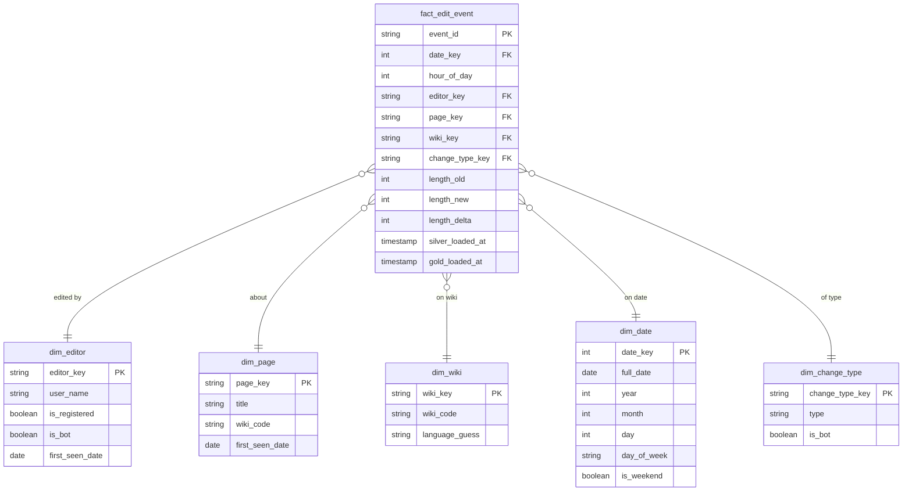

# SPEC — Phase 4: Gold (Dimensional Modeling + Streamlit Dashboard)

**Depends on:** `SPEC-agnostic-architecture.md` (principles P1–P8, conventions 9.1–9.5), `SPEC-phase3-silver-cdf.md` (CDF enabled on silver, the Kimball-ready modeling decision from Section 3, `silver_recentchange.contract.yaml` contract, `BaseDeltaIngestor` base class).
**Does not redecide anything already fixed in those documents — only references them.**

---

## 1. Objective

Model silver as an explicit Kimball star schema, materialize it incrementally via `GoldIngestor`, and deliver a Streamlit dashboard for visualization — closing the month's analytical-consumption loop. Feature store and ML projects are explicitly out of scope for this round.

## 2. Scope

**In scope:**
- Dimensional modeling (star schema) with an exportable ER diagram.
- `GoldIngestor`, inheriting from `BaseDeltaIngestor`, reading silver's CDF incrementally.
- Surrogate key resolution for dimensions, with incremental upsert.
- A Streamlit dashboard with a minimal set of panels answering the stakeholder questions already mapped in this phase's theory.

**Out of scope (left for a future project, not this round):**
- Feature store (e.g., `gold_editor_features` with rolling windows for contributor churn).
- Any ML model (anomaly/vandalism detection, trend prediction).
- A new dashboard or additional layer to serve that future ML project — when it exists, it will have its own SPEC.

## 3. Modeling: Kimball star schema

Fact grain: **one edit event** (the same grain as silver — gold doesn't aggregate, it dimensions).



This diagram should also be saved as `docs/gold-model-diagram.mmd` — a standalone Mermaid file, exportable to PNG/SVG (via `mmdc` or mermaid.live) for use in the portfolio README.

### 3.1 Modeling decisions

- **`hour_of_day` is degenerate, not its own dimension.** With only 24 possible values and no additional attribute, creating `dim_hour` would be a trivial dimension with no real gain — KISS.
- **`dim_change_type` is a junk dimension** combining `type` and `is_bot` (both low-cardinality and correlated). It doesn't include `is_minor` because that field was never captured in the bronze/silver contract — adding it would require reopening Phases 1–3, which we won't do this round. It's recorded as a possible future extension, not implemented.
- **All dimensions use Type 1 SCD** (simple upsert, no versioning). Different from the SCD2 exercise on `dim_customer` in Week 1: there, a business attribute changed over time (e.g., customer address) that justified versioning. Here, `user`/`title`/`wiki_code` are essentially stable identity — the change history is already preserved upstream, in silver (insert-only + CDF). Gold doesn't need to duplicate that responsibility.
- **Deterministic (hash-based) surrogate key, not sequential.** `editor_key = sha2(user_name, 256)` (truncated), instead of a centralized incrementing counter. This is what makes the upsert safe in an incremental, distributed streaming context: there's no need to coordinate a single sequence generator, and the same natural key always produces the same surrogate key, on any run, making the process idempotent by construction.
- **`dim_date` and `dim_change_type` are static/seed**, not derived incrementally from streaming — generated once by `scripts/seed_gold_dimensions.py` (the project's date range; fixed `type`×`is_bot` combinations). Only `dim_editor`, `dim_page`, and `dim_wiki` are updated by `GoldIngestor` on every batch.

## 4. Why we don't need Kimball's classic "Unknown Member" pattern

Kimball recommends a `-1 / Unknown` row in every dimension for when a fact arrives referencing a natural key the dimension doesn't yet know (common when fact and dimension come from different source systems, arriving out of order). That's not the case here: `GoldIngestor` always upserts dimensions **before** resolving the fact's keys, within the same micro-batch — every natural key present in the batch has already been inserted or already existed by the time of resolution. A null foreign key on the fact would therefore be a sign of a bug (broken order of operations), not an expected case — and it's treated as such: fail-fast, not a silent "Unknown" row.

## 5. `GoldIngestor` (inherits from `BaseDeltaIngestor`)

```python
# src/lib/ingestors/delta_ingestors.py (continued — same base class as Phases 2 and 3)

class GoldIngestor(BaseDeltaIngestor):
    """Reads silver's CDF incrementally, resolves/updates dimensions (upsert
    by hash surrogate key), and materializes the fact. The only ingestor that
    writes to multiple Delta tables from a single incremental read."""

    def read_stream(self) -> DataFrame:
        """readStream over silver with .option('readChangeFeed', 'true')."""
        ...

    def transform(self, df: DataFrame) -> DataFrame:
        """Computes length_delta and the hash surrogate keys (editor_key,
        page_key, wiki_key). Doesn't resolve against the dimension tables yet —
        that happens in write_stream(), where upsert and resolution need to
        stay within the same batch transaction."""
        ...

    def write_stream(self, df: DataFrame) -> StreamingQuery:
        """Overrides the default: uses foreachBatch to write to several
        Delta tables from the same micro-batch (dimensions via MERGE,
        fact via append) — see Section 5.1."""
        ...
```

### 5.1 Why `foreachBatch`, and why it's safe under retry

Spark's standard `writeStream` writes to a single sink. To write to several Delta tables (three dimensions + one fact) from a single incremental read, the correct mechanism is `foreachBatch(func)`, where `func(batch_df, batch_id)` runs like an ordinary batch and can perform multiple writes:

```python
def _write_batch(batch_df: DataFrame, batch_id: int) -> None:
    upsert_dimension(batch_df, "dim_editor", natural_key="user_name", surrogate_key="editor_key")
    upsert_dimension(batch_df, "dim_page", natural_key="title", surrogate_key="page_key")
    upsert_dimension(batch_df, "dim_wiki", natural_key="wiki_code", surrogate_key="wiki_key")
    fact_df = resolve_fact_keys(batch_df)  # join against the just-updated dimensions
    fact_df.write.format("delta").mode("append").save(fact_path)
```

If any write inside `_write_batch` fails, the streaming checkpoint **does not advance** — Spark retries the entire batch on the next attempt. This is only safe because the dimension upsert is deterministic (hash surrogate key, not sequential): reprocessing the same batch produces exactly the same result, never a second row for the same member. If we were using a centralized incrementing counter, a retry could generate different keys for the same member — another reason for the Section 3.1 decision.

## 6. Data Contract

`contracts/gold_star_schema.contract.yaml` (P8) — a single file covering the fact table and the three incremental dimensions (`dim_date`/`dim_change_type` don't need a contract since they're static and trivial). Structural: schema of each table + type/nullability of each key. No null FK is a value tolerated by the contract — a violation is fail-fast (Section 4).

## 7. Streamlit dashboard

- **Reads via DuckDB, not Spark.** The dashboard doesn't need a SparkSession to serve interactive queries — it reuses the same lightweight-read pattern already established in `scripts/inspect_bronze.py` (Phase 2): `SELECT ... FROM delta_scan('<uri>')`. The URI is resolved via `StorageBackend.resolve_uri()` (DRY — no duplicated path/credential logic).
- **Config identical to the rest of the pipeline:** `STORAGE_BACKEND=minio|gcs` switches where the dashboard reads from, with no code change — the same principle as every previous phase.

### 7.1 Panels (answering the stakeholder questions mapped in this phase's theory)

| Panel | Question it answers | Source |
|---|---|---|
| Edit volume over time, per wiki | Which wikis are growing fastest? | `fact_edit_event` + `dim_date` + `dim_wiki` |
| Bot vs. human proportion | What's the composition of automated edits? | `fact_edit_event` + `dim_change_type` |
| Distribution by hour of day | When is edit volume highest (seasonality)? | `fact_edit_event.hour_of_day` |
| Top pages by absolute `length_delta` | Which pages had large/suspicious edits recently? | `fact_edit_event` + `dim_page` |
| Top editors by recent volume | Who are the most active contributors right now? | `fact_edit_event` + `dim_editor` |

None of these panels implements the feature store or the churn/anomaly model discussed earlier — they're descriptive, a foundation for when that future project exists.

## 8. Configuration

| Variable | Values | Required |
|---|---|---|
| `COMPUTE_BACKEND` | `local` \| `databricks` (inherited) | Yes |
| `STORAGE_BACKEND` | `minio` \| `gcs` (inherited) | Yes |
| `GOLD_FACT_TABLE_PATH` / `GOLD_DIM_*_TABLE_PATH` | logical paths | Yes |
| `GOLD_CHECKPOINT_PATH` | `GoldIngestor`'s checkpoint path | Yes |

## 9. Code structure for this phase

```
contracts/
└── gold_star_schema.contract.yaml
docs/
└── gold-model-diagram.mmd            # same diagram as Section 3, standalone exportable
src/lib/ingestors/
└── delta_ingestors.py                # + GoldIngestor(BaseDeltaIngestor)
src/transform_gold/
├── schema.py                         # fact/dimension schemas
├── surrogate_keys.py                 # hash_surrogate_key(), upsert_dimension(), resolve_fact_keys()
└── cli.py
scripts/
└── seed_gold_dimensions.py           # populates dim_date/dim_change_type once
dashboard/
├── app.py                            # Streamlit, panels from Section 7.1
└── data_access.py                    # DuckDB wrapper + StorageBackend.resolve_uri()
```

## 10. Acceptance criteria (Given/When/Then)

1. **Fact without loss**
   Given a batch from silver's CDF, When `GoldIngestor.run()` executes, Then `fact_count_this_batch == silver_valid_rows_processed_this_batch`.

2. **No null foreign key**
   Given any row in `fact_edit_event`, When I inspect the fact table after a run, Then none of the foreign keys (`editor_key`, `page_key`, `wiki_key`, `date_key`, `change_type_key`) is null — a violation is fail-fast, not a silent "Unknown" row.

3. **Idempotent upsert under retry**
   Given the same batch processed twice (simulating a failure and re-run), When `GoldIngestor.run()` runs again, Then no dimension gains a second row for the same member (same hash surrogate key on both runs).

4. **Exportable diagram**
   Given `docs/gold-model-diagram.mmd`, When processed by `mmdc` (Mermaid CLI), Then it generates a valid PNG/SVG with no syntax error.

5. **Dashboard doesn't depend on Spark**
   Given the Streamlit dashboard running, When any panel is loaded, Then no SparkSession is created — only DuckDB queries via `delta_scan()`.

6. **Portability**
   Given the same `GoldIngestor` and dashboard code, When I run it with `STORAGE_BACKEND=minio` and, separately, `STORAGE_BACKEND=gcs`, Then the result is identical, with no change to `src/transform_gold/` or `dashboard/`.

## 11. Required tests

- `tests/test_surrogate_keys.py`: the same natural key always produces the same hash key; different keys never collide for the test set.
- `tests/test_gold_ingestor.py`: runs `GoldIngestor` against a local silver fixture, validates acceptance criteria 1–3 above.
- `tests/test_dashboard_data_access.py`: `data_access.py` returns the correct result against a local gold fixture, with no network dependency.

## 12. Operating commands

```bash
# One-time seed of the static dimensions (run once, or when the date range changes)
python scripts/seed_gold_dimensions.py

# Process the available increment from silver's CDF
python -m src.transform_gold.cli

# Run the dashboard locally
streamlit run dashboard/app.py

# Export the model diagram to PNG (requires @mermaid-js/mermaid-cli)
mmdc -i docs/gold-model-diagram.mmd -o docs/gold-model-diagram.png
```
